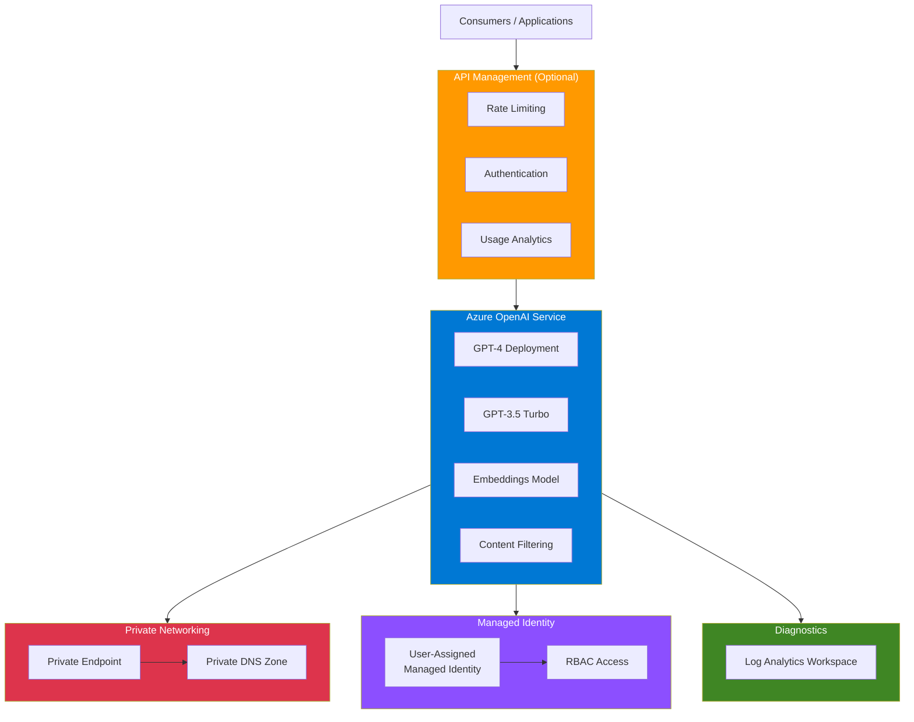

# terraform-azure-openai-platform

Terraform module for deploying Azure OpenAI Service with model deployments, private networking, content filtering, managed identity, and an optional API Management (APIM) front-end.

## Architecture



### ASCII Diagram

```
                                 +---------------------+
                                 |    Consumers /      |
                                 |    Applications     |
                                 +---------+-----------+
                                           |
                                           | HTTPS
                                           v
                              +------------------------+
                              |  Azure API Management  |
                              |  (Optional Front-End)  |
                              |                        |
                              |  - Rate limiting       |
                              |  - Authentication      |
                              |  - Request routing     |
                              |  - Usage analytics     |
                              +------------+-----------+
                                           |
                                           | Internal / Private
                                           v
                              +------------------------+
                              |   Azure OpenAI Service |
                              |   (Cognitive Account)  |
                              |                        |
                              |  +------------------+  |
                              |  | GPT-4 Deployment |  |
                              |  +------------------+  |
                              |  | GPT-3.5 Turbo    |  |
                              |  +------------------+  |
                              |  | Embeddings       |  |
                              |  +------------------+  |
                              |                        |
                              |  Content Filtering     |
                              +------------+-----------+
                                           |
                          +----------------+----------------+
                          |                                 |
               +----------v----------+          +----------v----------+
               |   Private Endpoint  |          |   Managed Identity  |
               |   (VNet Integration)|          |   (RBAC Access)     |
               +---------------------+          +---------------------+
                          |
               +----------v----------+
               |   Private DNS Zone  |
               +---------------------+
                          |
               +----------v----------+
               |  Log Analytics      |
               |  (Diagnostics)      |
               +---------------------+
```

### Flow: APIM to OpenAI

1. Client applications send requests to the **APIM Gateway URL**.
2. APIM applies policies (rate limiting, authentication, transformation) and forwards the request.
3. APIM routes traffic to the **Azure OpenAI Service** endpoint via the configured API backend.
4. OpenAI processes the request through the specified **model deployment** with **content filtering** applied.
5. When private endpoint is enabled, traffic flows through the **VNet** and is resolved via **Private DNS**.
6. All requests and metrics are captured in **Log Analytics** when diagnostics are enabled.

## Features

- **Azure OpenAI Service** - Deploy a Cognitive Services account with OpenAI kind
- **Model Deployments** - Configure multiple model deployments (GPT-4, GPT-3.5 Turbo, embeddings, etc.)
- **Private Endpoint** - Secure network access via private endpoint and private DNS zone
- **Managed Identity** - User-assigned managed identity for RBAC-based access
- **Content Filtering** - Apply content filter policies to model deployments
- **API Management** - Optional APIM front-end for rate limiting, authentication, and analytics
- **Diagnostics** - Monitor with Log Analytics workspace integration
- **Network ACLs** - Fine-grained network access control with IP and VNet rules

## Usage

### Basic

```hcl
module "openai" {
  source = "github.com/kogunlowo123/terraform-azure-openai-platform"

  name                  = "my-openai-service"
  resource_group_name   = "my-resource-group"
  location              = "East US"
  custom_subdomain_name = "my-openai-subdomain"

  model_deployments = {
    "gpt-4" = {
      model_name    = "gpt-4"
      model_version = "0613"
      sku_name      = "Standard"
      sku_capacity  = 10
    }
  }

  enable_private_endpoint = false
  enable_managed_identity = false
  enable_diagnostics      = false

  network_acls = {
    default_action = "Allow"
  }
}
```

### With APIM Front-End

```hcl
module "openai" {
  source = "github.com/kogunlowo123/terraform-azure-openai-platform"

  name                  = "my-openai-service"
  resource_group_name   = "my-resource-group"
  location              = "East US"
  custom_subdomain_name = "my-openai-subdomain"

  model_deployments = {
    "gpt-4" = {
      model_name    = "gpt-4"
      model_version = "0613"
      sku_name      = "Standard"
      sku_capacity  = 40
    }
  }

  enable_apim          = true
  apim_name            = "my-apim"
  apim_sku             = "Developer_1"
  apim_publisher_name  = "My Organization"
  apim_publisher_email = "admin@example.com"

  enable_private_endpoint    = true
  private_endpoint_subnet_id = azurerm_subnet.endpoints.id
  private_dns_zone_id        = azurerm_private_dns_zone.openai.id

  enable_diagnostics         = true
  log_analytics_workspace_id = azurerm_log_analytics_workspace.this.id
}
```

## Requirements

| Name | Version |
|------|---------|
| terraform | >= 1.5.0 |
| azurerm | >= 3.80.0 |

## Inputs

| Name | Description | Type | Default | Required |
|------|-------------|------|---------|----------|
| name | Name of the Azure OpenAI Cognitive Services account | `string` | n/a | yes |
| resource_group_name | Resource group name | `string` | n/a | yes |
| location | Azure region | `string` | n/a | yes |
| sku_name | SKU for the Cognitive Services account | `string` | `"S0"` | no |
| custom_subdomain_name | Custom subdomain name | `string` | n/a | yes |
| model_deployments | Map of model deployments | `map(object)` | `{}` | no |
| enable_private_endpoint | Create a private endpoint | `bool` | `true` | no |
| private_endpoint_subnet_id | Subnet ID for private endpoint | `string` | `null` | no |
| private_dns_zone_id | Private DNS zone ID | `string` | `null` | no |
| enable_managed_identity | Create a user-assigned managed identity | `bool` | `true` | no |
| network_acls | Network ACL configuration | `object` | See variables.tf | no |
| enable_apim | Create an APIM front-end | `bool` | `false` | no |
| apim_name | APIM instance name | `string` | `null` | no |
| apim_sku | APIM SKU (e.g., Developer_1) | `string` | `"Developer_1"` | no |
| apim_publisher_name | APIM publisher name | `string` | `null` | no |
| apim_publisher_email | APIM publisher email | `string` | `null` | no |
| enable_diagnostics | Enable diagnostic settings | `bool` | `true` | no |
| log_analytics_workspace_id | Log Analytics workspace ID | `string` | `null` | no |
| content_filter_name | Content filter policy name | `string` | `null` | no |
| tags | Tags to apply to all resources | `map(string)` | `{}` | no |

## Outputs

| Name | Description | Sensitive |
|------|-------------|-----------|
| endpoint | Azure OpenAI endpoint URL | no |
| primary_key | Primary access key | yes |
| deployment_ids | Map of deployment names to IDs | no |
| private_endpoint_ip | Private endpoint IP address | no |
| apim_gateway_url | APIM gateway URL | no |

## Examples

- [Basic](./examples/basic/) - Minimal deployment without private endpoint or diagnostics
- [Advanced](./examples/advanced/) - Private endpoint, managed identity, and diagnostics
- [Complete](./examples/complete/) - Full deployment with APIM, private endpoint, content filtering, and diagnostics

## License

MIT License. See [LICENSE](./LICENSE) for details.
